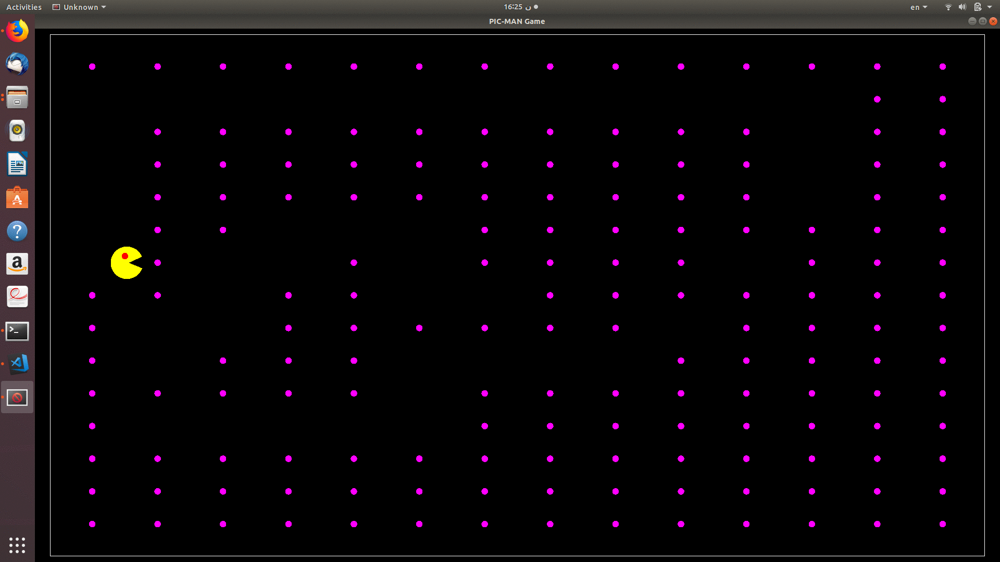

# PIC MAN Game Using GLUT

The main idea based on :
	 drawing Pic-man using basic shapes like circles and  triangle

drawing shapes based on :
	any regular Shape consists of multiple identicals triangles.

# Moving Pic-Man .
	
Movement of any Object based on :
	Using 2-main functions Translation & Rotation

# Making Pic-Man eat .
	- using translation to make it's mouth behave well as ( open and Close state )
	- Maping for the food Matrix To detect wether or not Picman visit(eat) or not this points

